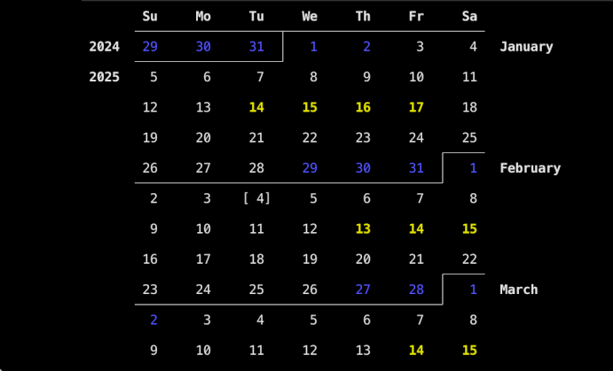

`nhmoon` is a [Rust](https://www.rust-lang.org) program for viewing & scrolling
through a slice of the calendar in your terminal.  Days with [new or full
moons][moon] in [NetHack][] are highlighted, though the code can easily be
adjusted to use different highlighting criteria instead.

[moon]: https://nethackwiki.com/wiki/Time#Moon_phase_and_date
[NetHack]: https://www.nethack.org

Screenshot of the program on startup on 2025 February 4:

Installation
============

In order to install `nhmoon`, you first need to have [Rust and Cargo
installed](https://www.rust-lang.org/tools/install).  You can then build the
latest version of `nhmoon` and install it in `~/.cargo/bin` by running:

    cargo install --git https://github.com/jwodder/nhmoon

Usage
=====

    nhmoon [<date>]

Opens a view of a proleptic Gregorian calendar centered on the given date, or
centered on the current date if no date is given.  Dates are given in the form
`YYYY-MM-DD` using [astronomical year numbering][years].  Only dates from
10,000 BC (-9999 in astronomical year numbering) through 9,999 AD are
supported.

[years]: https://en.wikipedia.org/wiki/Astronomical_year_numbering

The calendar highlights dates of NetHack full moons in bold yellow and new
moons in bright blue.

Key Bindings
------------

| Key                                | Command                 |
| ---------------------------------- | ----------------------- |
| <kbd>k</kbd>, <kbd>Up</kbd>        | Scroll up one week      |
| <kbd>j</kbd>, <kbd>Down</kbd>      | Scroll down one week    |
| <kbd>w</kbd>, <kbd>Page Up</kbd>   | Scroll up one page      |
| <kbd>z</kbd>, <kbd>Page Down</kbd> | Scroll down one page    |
| <kbd>0</kbd>, <kbd>Home</kbd>      | Jump to today           |
| <kbd>g</kbd>                       | Input a date to jump to |
| <kbd>?</kbd>                       | Show help               |
| <kbd>q</kbd>, <kbd>Escape</kbd>    | Quit                    |

Pressing <kbd>g</kbd> brings up an input prompt for entering a date in the form
`YYYY-MM-DD`.  (Enter digits only; the hyphens are filled in for you.)
Pressing <kbd>-</kbd> or <kbd>+</kbd> at the beginning of the prompt changes
the sign of the year.  Pressing <kbd>g</kbd>, <kbd>q</kbd>, or
<kbd>Escape</kbd> at any point while editing dismisses the prompt.  After
entering eight digits, press <kbd>Enter</kbd> to jump to the given date.
